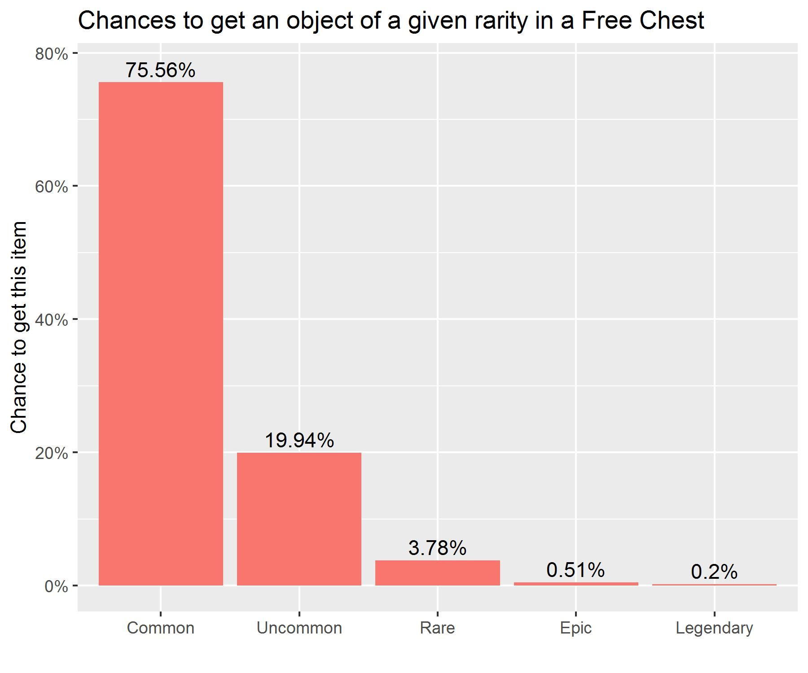

# Almost a Hero - Free Chest Analysis
## Motivation
Almost a Hero is Free-To-Play idle-RPG mobile game. As many FTP games, users can purchase lootboxes that awards currencies and items that are needed to progress in game. It is also common that these kind of games offer a FREE lootbox every [X] amount of hours to help retaining the user and creating the habit of connecting.

After having played this game (and a lot other games) for quite some time, I wanted to determine what is the value of this free lootbox and find what are the chances to get an object of a given rarity (Common, Uncommon, Rare, Epic, Legendary)

For this, I have been gathering screenshots for ~40 days and analyzed them with `imager`and `tesseract` packages

## Data
One free lootbox is available every 4 hours but it can be reduced to 1h, allowing me to open a lot of chests daily and gather the maximum data as possible.

In total:

Chests|Days
------|------
488|46

Each lootbox contains:
- Guaranteed amount of *Scraps*  [20-60]
- Guaranteed amount of *Tokens* [5-15]
- *Rarity* (associated to the colour of the border) and *Hero* of each item

For each lootbox, I was taking a screenshot of the rewards screen and reading the following information:

## Process
Text and numbers were extracted directly from the parts of the screenshot with function `tesseract::ocr_data()`

Rarity of the items was exctracted by selecting 1 pixel of the border of each and reading its RGB composition with function `imager::color.at()`. 
For some reason I have not investigated, this function gives slightly different values for objects of the same rarity.

To overcome this problem, I have used a clustering method to group the most similar values in rarity groups. I have tried three approaches:
1. Using k-means on the RGB data set
2. Using k-means on the reduced RGB dataset using PCA method
3. Using k-means with known centers.

## Results & Conclusions

### **Scraps & Tokens**
At first glance it looks like the chances to get any value in the range are uniformely distributed in the range *except there is not a single data point for the maximum values (60 and 15 respectively). It looks like the range is certainly [20-59] and [5-14]*

### **Hero objects & Rarities**
As in the case of the currencies, it looks like the chances to get an object for any hero of the game (wether the user have it unlocked or not) are uniformely distributed (and disregarding *Ron* which was added in the middle of my experiment)

Regarding the rarities, the values obtained by the clustering are:

Clearly, giving one example of each rarity to the clustering algorithm had the "best" or, at least, the most reliable one.
Leaving the composition of the chances as follow:

Rarity|Chances
------|------
Common|75.6%
Uncommon|19.9%
Rare|3.78%
Epic|0.511%
Legendary|0.204%

#### Value

**Scraps** is the scarcest currency in the game and the one that drives all progression, so to calculate the "value" of the chests I will translate everything to it based on the following conversions:

Item|Gem Cost
200 Scraps | 20 Gems
175 Tokens | 25 Gems

1 Gem = 7 Tokens = 10 Scraps

Rarity|Scrap Value (based on the game conversion)
------|------
Common|10
Uncommon|25
Rare|75
Epic|150
Legendary|300

Value per Item = (10 x 0.756) + (25 x 0.199) + (75 x 0.0378) + (150 x 0.00511) + (300 x 0.00204) = 16.75

So, we have:
- Scraps = 19.5 scraps
- Tokens = 4.5 tokens = 3.15 scraps
- Objects (x2) = 33.497 scraps

Total Value in Scraps per chest = 56.147

