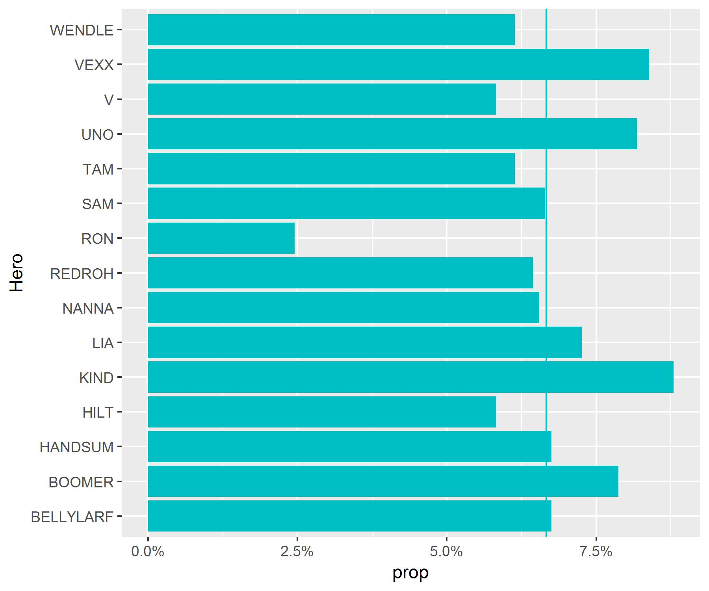
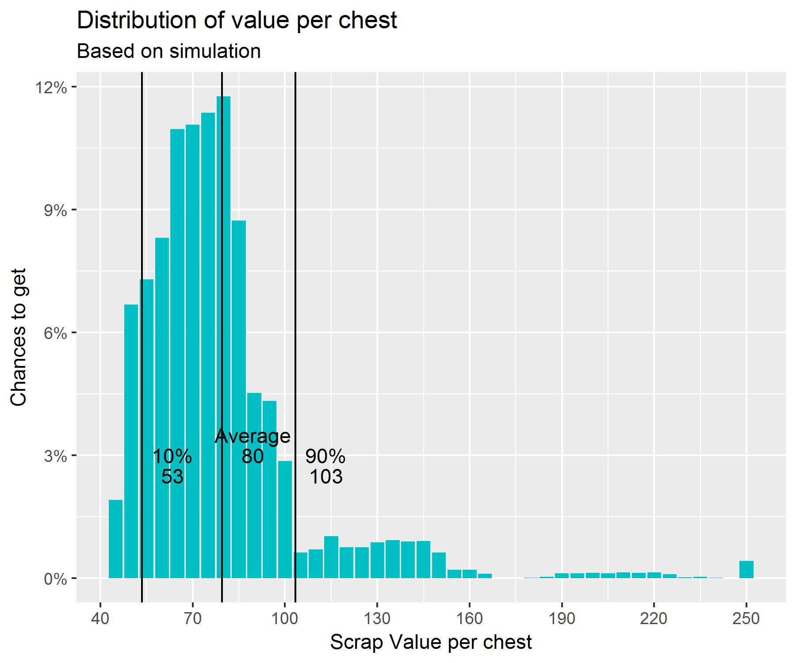

# Almost a Hero - Free Chest Analysis
## Motivation
Almost a Hero is Free-To-Play idle-RPG mobile game. As many FTP games, users can purchase lootboxes that awards currencies and items that are needed to progress in game. It is also common that these kind of games offer a FREE lootbox every [X] amount of hours to help retaining the user and creating the habit of connecting.

I have played this game (and a lot other games) for quite some time and I felt curiosity to determine what is the value of this free lootbox and find what are the chances to get an object of a given rarity (Common, Uncommon, Rare, Epic, Legendary)

For this, I have been gathering screenshots for ~40 days and analyzed them with `imager`and `tesseract` packages.

## Data
One free lootbox is available every 4 hours but it can be reduced to 1h, allowing me to open a lot of chests daily and gather the maximum data as possible. In total, I gathered:

Chests|Days
------|------
488|46

Each lootbox contains:
- Guaranteed amount of *Scraps*  [20-60]
- Guaranteed amount of *Tokens* [5-15]
- 2 Items of given *Hero* and *Rarity* (based on the colour of the border) 

For each lootbox, I was taking a screenshot of the rewards screen and reading the following information:

## Process
Text and numbers were extracted directly from the parts of the screenshot with function `tesseract::ocr_data()`

Rarity of the items was exctracted by selecting 1 pixel of the border of each item and reading its RGB composition with function `imager::color.at()`. 
For some reason I have not investigated, this function gives slightly different values for objects that are the same rarity and thus the same colour.

To overcome this problem, I have used a clustering method (k-means) to group the most similar values in rarity groups, given an example for each rarity.

## Results & Conclusions

### **Scraps & Tokens**
At first glance it looks like the chances to get any value in the range are uniformely distributed in the range *except there is not a single data point for the maximum values (60 and 15 respectively). It looks like the range is certainly [20-59] and [5-14]*

### **Hero objects & Rarities**
As in the case of the currencies, it looks like the chances to get an object for any hero of the game (wether the user have it unlocked or not) are uniformely distributed (and disregarding *Ron* which was added in the middle of my experiment)

Regarding rarity, the distribution found is as follow:

#### Value

**Scraps** is the scarcest currency (apart from Gems - paid currency) in the game and the one that drives all progression, so to calculate the "value" of the lootbox I will translate everything to it based on the following conversions:

If:

Item|Gem Cost
-----|------
200 Scraps | 20 Gems
175 Tokens | 25 Gems

Then:

1 Gem = 7 Tokens = 10 Scraps

Rarity|Scraps Value (based on the game conversion)
------|------
Common|10
Uncommon|25
Rare|75
Epic|150
Legendary|300

Assuming the previous chances and conversions, I have created a function to simulate a lootbox and run a simulation of 100k openings. Getting that the "average value"" of a Free lootbox is **80** scraps, ranging from 53 to 103 in most of the cases (80%)

#### Comments and assumptions
- Data was collected from 23rd of October to 7th of December of 2018
- During this period the game was updated and the findings could no longer apply to what is actually in-game
- Tokens have been included to assess the "value" of the lootbox altough there is not any explicit way to convert them to Scraps in the game.
- The 2 items in the chest have been considered independent of each other, but it could be that they are correlated. And for example, the chance to get 2 objects of high rarity in the same chest is restricted by the designers.

