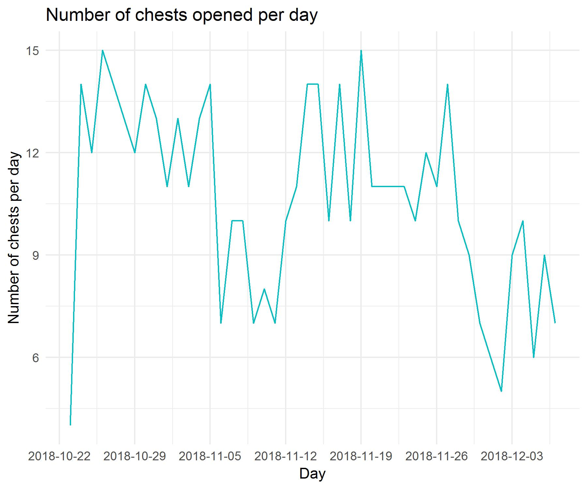

# Almost a Hero - Free Chest Analyzer
Almost a Hero is free-to-play idle-RPG mobile game. As many FTP games, users can purchase lootboxes that awards currencies and items that are needed to progress in game. It is also common that these kind of games offer a FREE lootbox every X amount of hours to help retaining the user and creating the habit of connecting.

After having played this game (and a lot other games) for quite some time, I wanted to determine what is the value of this free lootbox and use it to do a small data project.

For this, I have been gathering screenshots for ~40 days and analyzed them with some image processing package

### Data
A free lootbox is available every 4 hours but after progressing in the game users can upgrade their stats and reduce the time to 1 hour.
With that upgrade at max level I was able to open a lot of chests every day.

In total:

Chests|Days
------|------
488|46

I was taking a screenshot of the reward of each chest and gathering the information:
The loot had always the same composition:
- Guaranteed amount of *Scraps*  [20-60]
- Guaranteed amount of *Tokens* [5-15]
- *Rarity* (associated to the colour of the border) and *Hero* of each item

